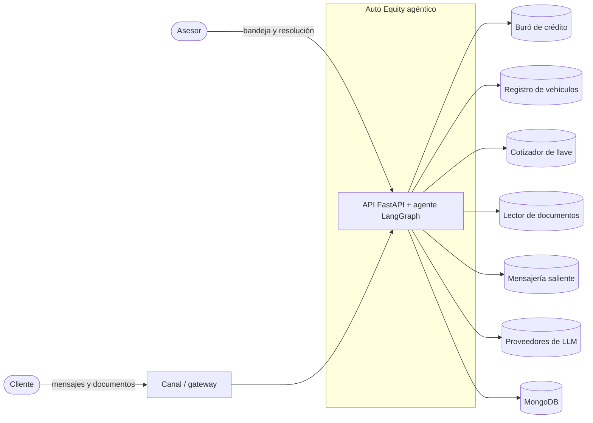
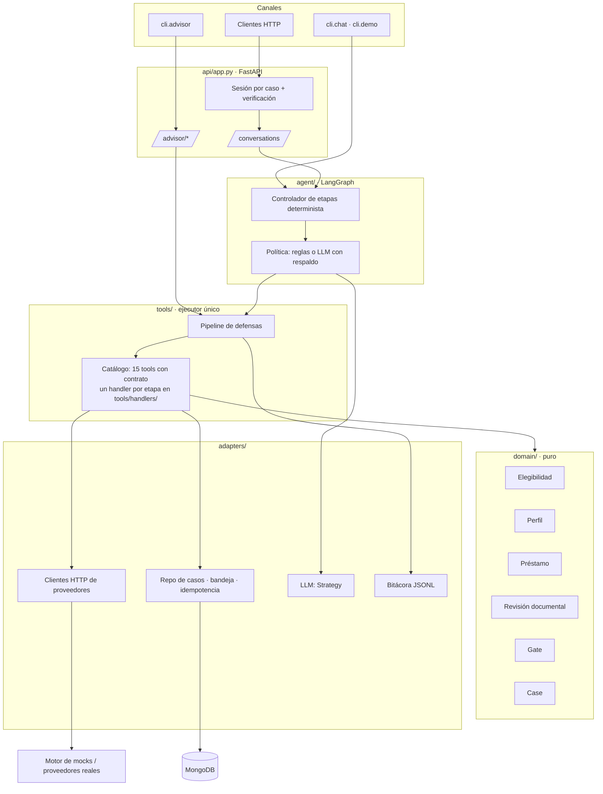
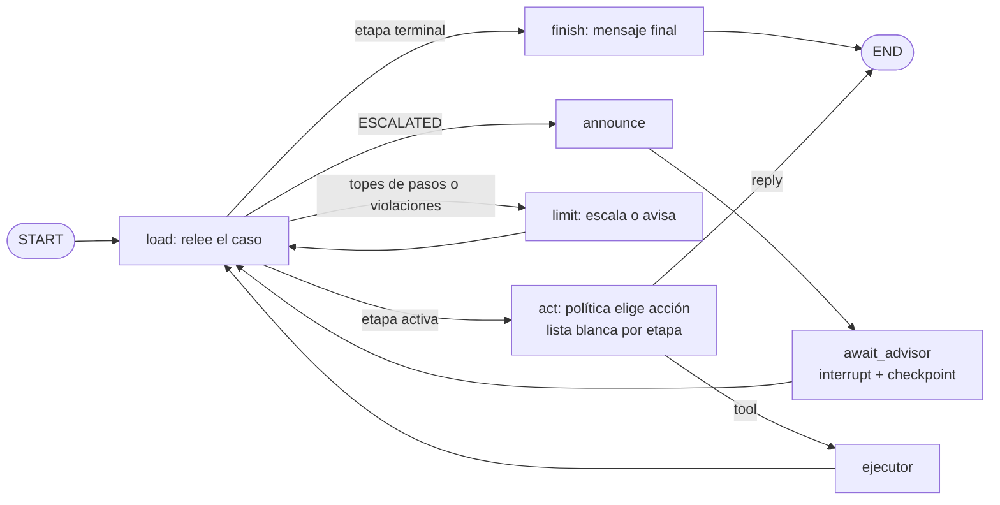
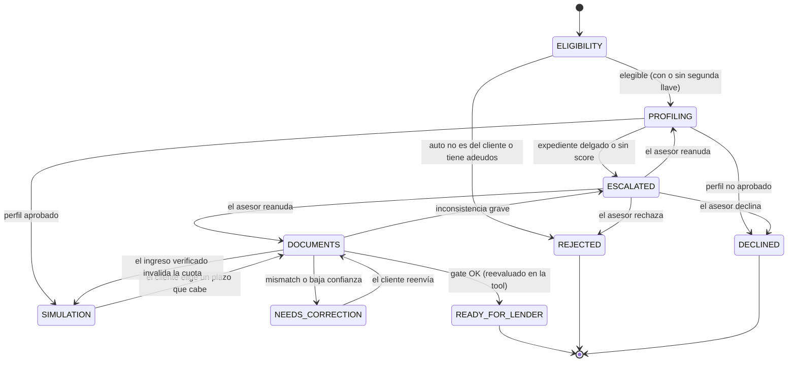
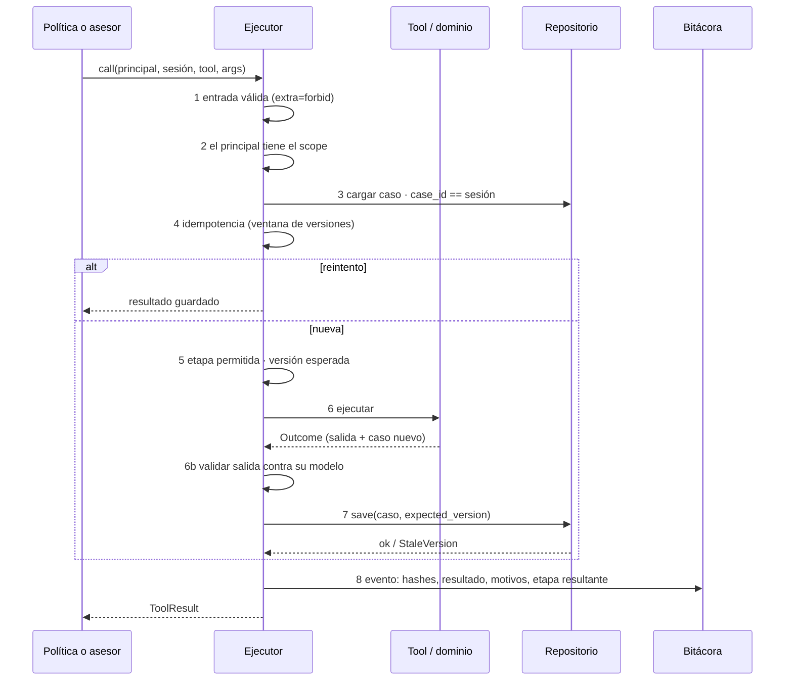
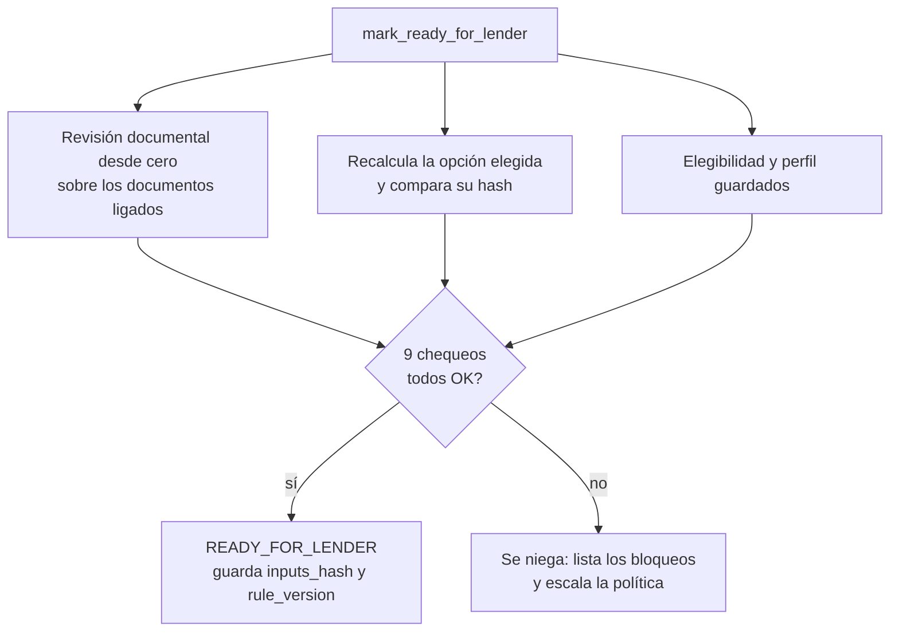
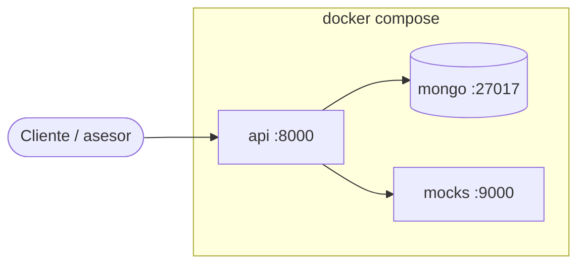
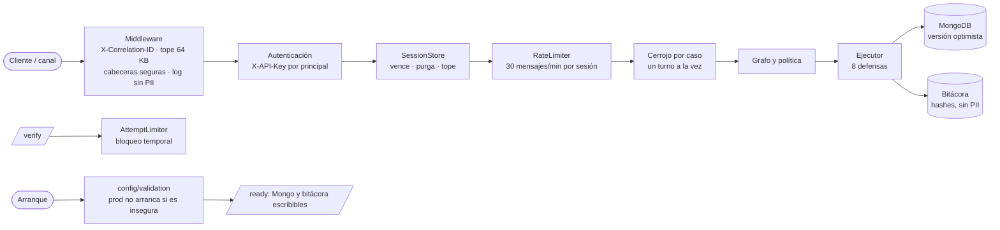

# Arquitectura (C4)

## 1. Contexto

Los proveedores externos están **detrás de puertos**. En `mock` los simula el
motor de mocks en proceso; en otros ambientes son URLs.

## 2. Contenedores

## 3. Un turno de conversación

`act` pide a la política **una** acción; si es una tool la ejecuta por el
ejecutor y **vuelve a `load`**, que relee el caso: la etapa la dicta el
dominio.

## 4. Estados del caso

Desde `ESCALATED` solo se reanuda **donde se escaló** (`escalated_from`) o se
cierra. Las etapas terminales no tienen salidas.

## 5. Pipeline del ejecutor

## 6. El gate (`mark_ready_for_lender`)

Chequeos: `eligibility`, `profile`, `simulation_current`, `documents_present`,
`documents_valid`, `income_identity`, `ownership`, `payment_capacity`,
`no_open_corrections`.

## 7. Despliegue

`mock` no necesita nada de esto: todo corre en proceso.

## 8. Camino de una petición (operación y seguridad)

El arranque falla si la configuración es insegura o si no se puede escribir la
bitácora (ADR-0006); `/ready` repite esa comprobación en cada sondeo.

